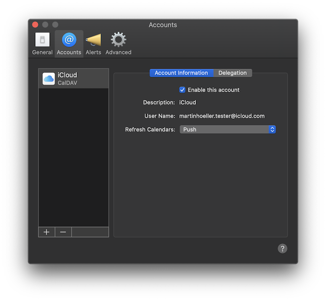
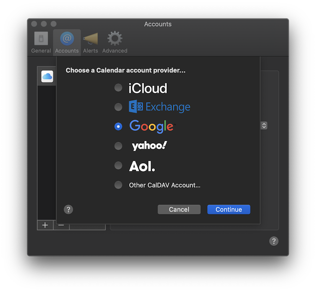

It is very easy to set up alerts for any calendar service that is supported by the macOS Calendar app. Follow these steps:

1. Open the macOS Calendar app
2. Open the Calendar settings window via the menu Calendar > Settings…
3. Click the "Accounts" tab in the toolbar

4. Click the + button at the bottom of the accounts list
5. Choose the appropriate account type and follow the instructions to authenticate your account

6. Make sure your newly added calendar shows up in the Calendar app

Now you are all set up and **In Your Face** should be able to recognize your newly added calendar and show alerts for it.
