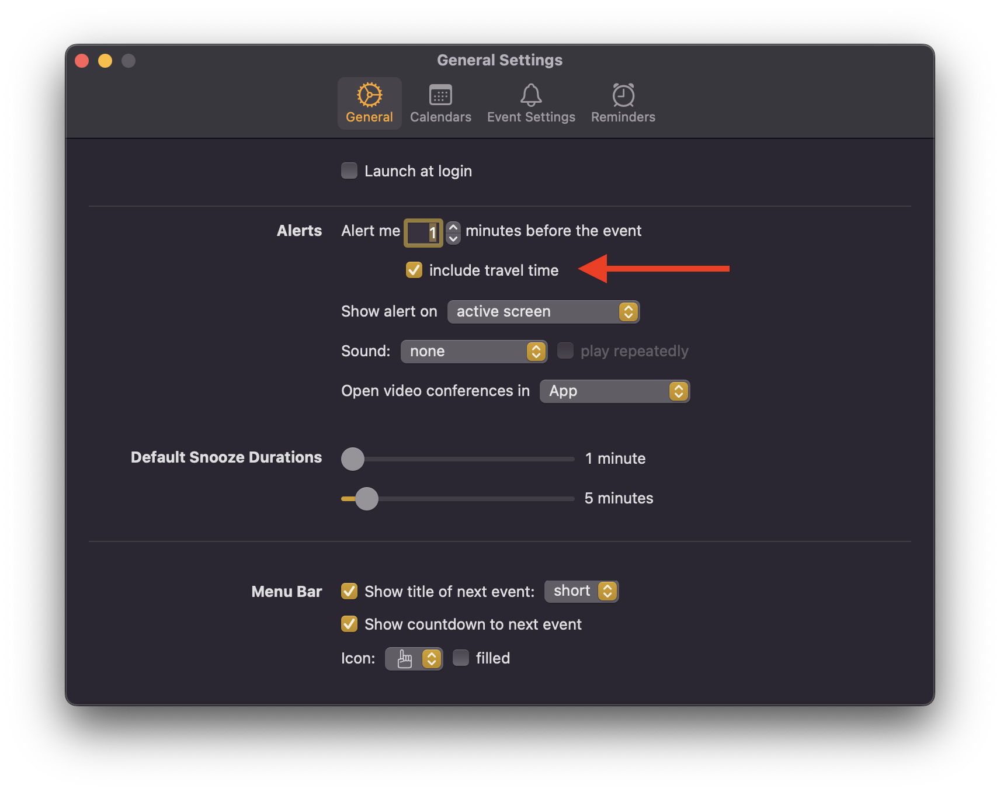
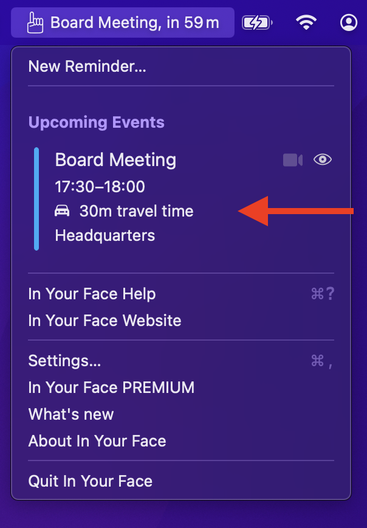
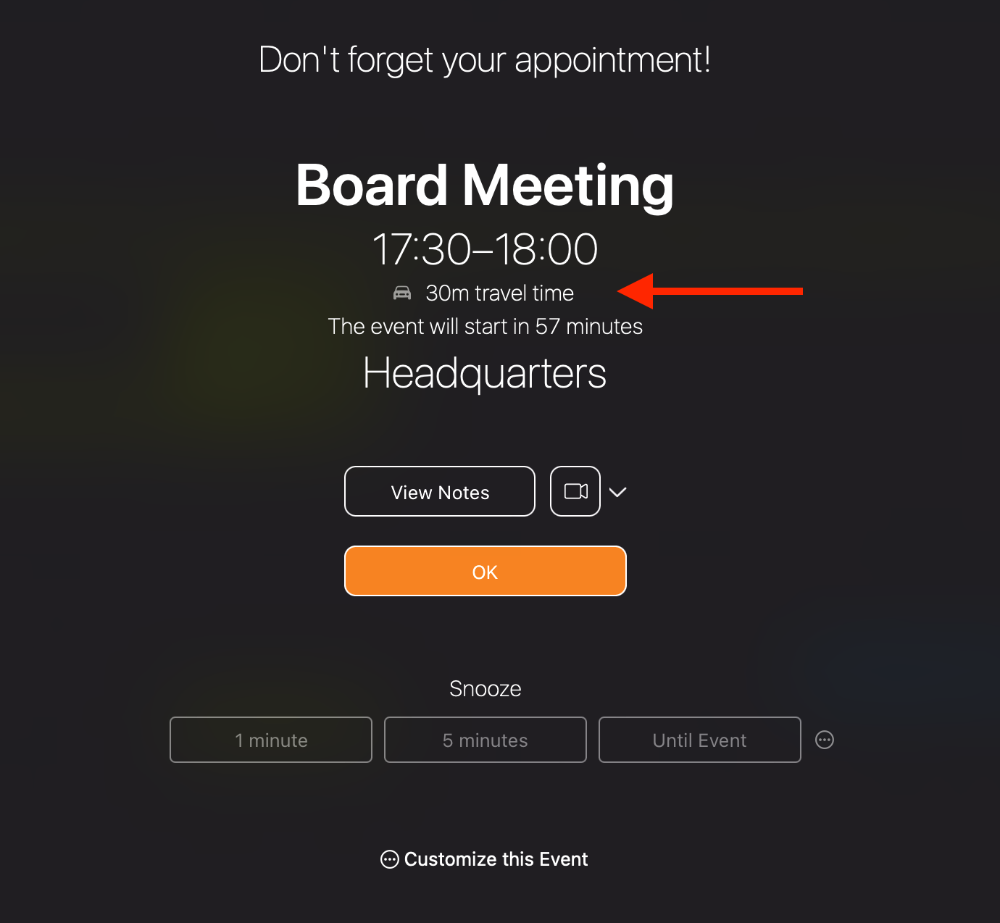

Calendar events can have a travel time, either calculated automatically if the event has a location, or set manually (see this [Apple Support article](https://support.apple.com/guide/calendar/add-location-and-travel-time-to-events-icl43600/mac) for further information).

You can set up **In Your Face** to utilize this travel time in order to alert you about events when you need to leave to arrive at the location in time. Activate the travel time option in the app's settings:

Once the setting is active you will see the travel time both in the menu and on alerts:

 

**In Your Face** will take the travel time into account when alerting you about the event. 

*Example:*
An event starts at 3:00 p.m. and has 30 minutes of travel time. If **In Your Face** usually alerts you 1 minute before the event you will see the alert at 2:29 p.m.